# Implementation DAG

**59 tasks**, acyclic. Machine-readable source: [`dag.yaml`](dag.yaml).

## Mermaid graph

```mermaid
flowchart TD
  FND_001["FND-001: Bootstrap Rust workspace and quality gates"]
  FND_002["FND-002: Install canonical contract snapshot and protobuf generation"]
  FND_003["FND-003: Implement domain IDs, core enums, and immutable value types"]
  FND_004["FND-004: Implement stable error model"]
  FND_005["FND-005: Build deterministic testkit and fault-injection hooks"]
  FND_006["FND-006: Initialize classified tracing and metrics substrate"]
  PST_001["PST-001: Create inception SQLite KernelStore schema"]
  PST_002["PST-002: Define KernelStore transaction interfaces"]
  PST_003["PST-003: Implement SQLite KernelStore transactions and repositories"]
  PST_004["PST-004: Implement OS daemon lock and durable fencing epoch"]
  PST_005["PST-005: Implement idempotency and transactional outbox primitives"]
  CMD_001["CMD-001: Implement Command Coordinator linearization path"]
  EVT_001["EVT-001: Implement event envelopes, stream keys, cursors, and sequence helpers"]
  EVT_002["EVT-002: Implement EventJournalPort and SQLite Event Journal"]
  EVT_003["EVT-003: Implement outbox dispatcher with journal-first publication"]
  EVT_004["EVT-004: Implement durable Live Event Bus and lag semantics"]
  RUN_000["RUN-000: Implement AgentSpec, Session, Task, and initial AgentRun commands"]
  RUN_001["RUN-001: Implement AgentRun state machine and revision rules"]
  RUN_002["RUN-002: Implement transactional RunGraph edge mutation and cycle prevention"]
  RUN_003["RUN-003: Implement dependency satisfaction and atomic ready-run claiming"]
  RUN_004["RUN-004: Implement cancellation epochs and subtree cancellation"]
  RUN_005["RUN-005: Implement startup run reconstruction and recovery dispositions"]
  EFF_001["EFF-001: Implement effect contract model and conservative policy resolver"]
  EFF_002["EFF-002: Implement EffectRecord transitions and preparation"]
  EFF_003["EFF-003: Implement effect executor leases and fencing"]
  EFF_004["EFF-004: Implement effect reconciliation and Unknown handling"]
  RES_001["RES-001: Implement durable resource reservations and budget delegation"]
  SCH_001["SCH-001: Implement durable one-shot scheduler timers"]
  SEC_001["SEC-001: Implement principals, actors, delegation chains, and grant lineage"]
  SEC_002["SEC-002: Implement capability and permission engine"]
  SEC_003["SEC-003: Implement immutable approval request/response flow"]
  SEC_004["SEC-004: Implement Secrets Broker and macOS Keychain store"]
  ADP_001["ADP-001: Implement supervised external process lifecycle and private socketpair IPC"]
  ADP_002["ADP-002: Implement framed protobuf external adapter protocol"]
  ADP_003["ADP-003: Implement content-addressed adapter registry"]
  ADP_004["ADP-004: Implement port capability negotiation and deterministic resolver"]
  ADP_005["ADP-005: Build fixture external effect adapter"]
  WRK_001["WRK-001: Implement logical Resource URI parser/resolver"]
  WRK_002["WRK-002: Implement local workspace adapter and Git worktree primitives"]
  WRK_003["WRK-003: Implement Workspace Coordinator leases, transfer, fork, and merge"]
  SBOX_001["SBOX-001: Implement Sandbox Manager and T0 trusted local-process adapter"]
  ART_001["ART-001: Implement local ArtifactStore and metadata"]
  CFG_001["CFG-001: Implement inception config parser and schema validation"]
  CFG_002["CFG-002: Implement immutable config generations and tested activation"]
  CFG_003["CFG-003: Implement runtime profile resolution and frozen ResolvedRunEnvironment"]
  LOOP_001["LOOP-001: Build fixture external AgentLoop process"]
  LOOP_002["LOOP-002: Implement loop turn supervisor and fenced decision acceptance"]
  API_001["API-001: Implement local gRPC server over Unix-domain socket"]
  API_002["API-002: Implement command/query Control API methods"]
  API_003["API-003: Implement Event API read and live subscription"]
  API_004["API-004: Build local control CLI"]
  INT_001["INT-001: Compose agentd startup/shutdown and basic end-to-end run"]
  INT_002["INT-002: Verify hierarchical children and workspace delegation end-to-end"]
  INT_003["INT-003: Verify effect crash/restart and reconciliation end-to-end"]
  INT_004["INT-004: Run concurrency and property invariant suite"]
  INT_005["INT-005: Run security and protocol invariant suite"]
  REL_001["REL-001: Implement automated MVP release gate"]
  QUE_001["QUE-001: Implement MessageQueuePort and in-memory generation-global adapter"]
  ADP_006["ADP-006: Implement adapter conformance harness and activation gate"]
  FND_001 --> FND_002
  FND_002 --> FND_003
  FND_001 --> FND_004
  FND_001 --> FND_005
  FND_003 --> FND_005
  FND_001 --> FND_006
  FND_003 --> FND_006
  FND_004 --> FND_006
  FND_003 --> PST_001
  FND_004 --> PST_001
  FND_003 --> PST_002
  FND_004 --> PST_002
  PST_001 --> PST_003
  PST_002 --> PST_003
  FND_005 --> PST_003
  PST_003 --> PST_004
  FND_005 --> PST_004
  PST_003 --> PST_005
  PST_004 --> PST_005
  PST_005 --> CMD_001
  FND_006 --> CMD_001
  FND_003 --> EVT_001
  PST_005 --> EVT_001
  EVT_001 --> EVT_002
  FND_004 --> EVT_002
  EVT_002 --> EVT_003
  PST_005 --> EVT_003
  FND_005 --> EVT_003
  EVT_003 --> EVT_004
  CMD_001 --> RUN_000
  PST_003 --> RUN_000
  CMD_001 --> RUN_001
  FND_003 --> RUN_001
  RUN_000 --> RUN_001
  RUN_001 --> RUN_002
  PST_003 --> RUN_002
  RUN_002 --> RUN_003
  RUN_002 --> RUN_004
  RUN_001 --> RUN_004
  RUN_003 --> RUN_005
  RUN_004 --> RUN_005
  PST_004 --> RUN_005
  FND_003 --> EFF_001
  FND_004 --> EFF_001
  EFF_001 --> EFF_002
  CMD_001 --> EFF_002
  RUN_001 --> EFF_002
  EFF_002 --> EFF_003
  PST_004 --> EFF_003
  EFF_003 --> EFF_004
  RUN_005 --> EFF_004
  CMD_001 --> RES_001
  RUN_001 --> RES_001
  CMD_001 --> SCH_001
  PST_003 --> SCH_001
  FND_005 --> SCH_001
  FND_003 --> SEC_001
  PST_003 --> SEC_001
  SEC_001 --> SEC_002
  FND_004 --> SEC_002
  SEC_002 --> SEC_003
  CMD_001 --> SEC_003
  SEC_002 --> SEC_004
  SEC_003 --> SEC_004
  FND_006 --> SEC_004
  PST_004 --> ADP_001
  FND_006 --> ADP_001
  ADP_001 --> ADP_002
  FND_002 --> ADP_002
  ADP_002 --> ADP_003
  PST_003 --> ADP_003
  ADP_003 --> ADP_004
  ADP_004 --> ADP_005
  EFF_004 --> ADP_005
  FND_003 --> WRK_001
  SEC_002 --> WRK_001
  WRK_001 --> WRK_002
  ADP_004 --> WRK_002
  WRK_002 --> WRK_003
  RUN_004 --> WRK_003
  SEC_002 --> WRK_003
  ADP_004 --> SBOX_001
  WRK_003 --> SBOX_001
  SEC_004 --> SBOX_001
  WRK_001 --> ART_001
  PST_003 --> ART_001
  ADP_004 --> CFG_001
  ADP_006 --> CFG_001
  FND_002 --> CFG_001
  QUE_001 --> CFG_001
  CFG_001 --> CFG_002
  CMD_001 --> CFG_002
  CFG_002 --> CFG_003
  WRK_003 --> CFG_003
  SBOX_001 --> CFG_003
  ART_001 --> CFG_003
  ADP_004 --> LOOP_001
  RUN_001 --> LOOP_001
  LOOP_001 --> LOOP_002
  RUN_005 --> LOOP_002
  EFF_002 --> LOOP_002
  RUN_004 --> LOOP_002
  PST_004 --> API_001
  FND_006 --> API_001
  FND_002 --> API_001
  API_001 --> API_002
  CMD_001 --> API_002
  CFG_003 --> API_002
  EFF_004 --> API_002
  SEC_003 --> API_002
  API_001 --> API_003
  EVT_004 --> API_003
  EVT_002 --> API_003
  API_002 --> API_004
  API_003 --> API_004
  API_004 --> INT_001
  LOOP_002 --> INT_001
  SCH_001 --> INT_001
  RES_001 --> INT_001
  INT_001 --> INT_002
  WRK_003 --> INT_002
  INT_001 --> INT_003
  ADP_005 --> INT_003
  RUN_004 --> INT_004
  EFF_004 --> INT_004
  RES_001 --> INT_004
  SCH_001 --> INT_004
  WRK_003 --> INT_004
  CFG_002 --> INT_004
  SEC_004 --> INT_005
  SBOX_001 --> INT_005
  ADP_005 --> INT_005
  API_003 --> INT_005
  INT_002 --> REL_001
  INT_003 --> REL_001
  INT_004 --> REL_001
  INT_005 --> REL_001
  FND_002 --> QUE_001
  FND_003 --> QUE_001
  ADP_005 --> ADP_006
```

## Valid topological execution order

1. [FND-001 — Bootstrap Rust workspace and quality gates](tasks/FND-001.md)
2. [FND-002 — Install canonical contract snapshot and protobuf generation](tasks/FND-002.md)
3. [FND-003 — Implement domain IDs, core enums, and immutable value types](tasks/FND-003.md)
4. [FND-004 — Implement stable error model](tasks/FND-004.md)
5. [EFF-001 — Implement effect contract model and conservative policy resolver](tasks/EFF-001.md)
6. [FND-005 — Build deterministic testkit and fault-injection hooks](tasks/FND-005.md)
7. [FND-006 — Initialize classified tracing and metrics substrate](tasks/FND-006.md)
8. [PST-001 — Create inception SQLite KernelStore schema](tasks/PST-001.md)
9. [PST-002 — Define KernelStore transaction interfaces](tasks/PST-002.md)
10. [PST-003 — Implement SQLite KernelStore transactions and repositories](tasks/PST-003.md)
11. [PST-004 — Implement OS daemon lock and durable fencing epoch](tasks/PST-004.md)
12. [ADP-001 — Implement supervised external process lifecycle and private socketpair IPC](tasks/ADP-001.md)
13. [ADP-002 — Implement framed protobuf external adapter protocol](tasks/ADP-002.md)
14. [ADP-003 — Implement content-addressed adapter registry](tasks/ADP-003.md)
15. [ADP-004 — Implement port capability negotiation and deterministic resolver](tasks/ADP-004.md)
16. [API-001 — Implement local gRPC server over Unix-domain socket](tasks/API-001.md)
17. [PST-005 — Implement idempotency and transactional outbox primitives](tasks/PST-005.md)
18. [CMD-001 — Implement Command Coordinator linearization path](tasks/CMD-001.md)
19. [EVT-001 — Implement event envelopes, stream keys, cursors, and sequence helpers](tasks/EVT-001.md)
20. [EVT-002 — Implement EventJournalPort and SQLite Event Journal](tasks/EVT-002.md)
21. [EVT-003 — Implement outbox dispatcher with journal-first publication](tasks/EVT-003.md)
22. [EVT-004 — Implement durable Live Event Bus and lag semantics](tasks/EVT-004.md)
23. [API-003 — Implement Event API read and live subscription](tasks/API-003.md)
24. [QUE-001 — Implement MessageQueuePort and in-memory generation-global adapter](tasks/QUE-001.md)
25. [RUN-000 — Implement AgentSpec, Session, Task, and initial AgentRun commands](tasks/RUN-000.md)
26. [RUN-001 — Implement AgentRun state machine and revision rules](tasks/RUN-001.md)
27. [EFF-002 — Implement EffectRecord transitions and preparation](tasks/EFF-002.md)
28. [EFF-003 — Implement effect executor leases and fencing](tasks/EFF-003.md)
29. [LOOP-001 — Build fixture external AgentLoop process](tasks/LOOP-001.md)
30. [RES-001 — Implement durable resource reservations and budget delegation](tasks/RES-001.md)
31. [RUN-002 — Implement transactional RunGraph edge mutation and cycle prevention](tasks/RUN-002.md)
32. [RUN-003 — Implement dependency satisfaction and atomic ready-run claiming](tasks/RUN-003.md)
33. [RUN-004 — Implement cancellation epochs and subtree cancellation](tasks/RUN-004.md)
34. [RUN-005 — Implement startup run reconstruction and recovery dispositions](tasks/RUN-005.md)
35. [EFF-004 — Implement effect reconciliation and Unknown handling](tasks/EFF-004.md)
36. [ADP-005 — Build fixture external effect adapter](tasks/ADP-005.md)
37. [ADP-006 — Implement adapter conformance harness and activation gate](tasks/ADP-006.md)
38. [CFG-001 — Implement inception config parser and schema validation](tasks/CFG-001.md)
39. [CFG-002 — Implement immutable config generations and tested activation](tasks/CFG-002.md)
40. [LOOP-002 — Implement loop turn supervisor and fenced decision acceptance](tasks/LOOP-002.md)
41. [SCH-001 — Implement durable one-shot scheduler timers](tasks/SCH-001.md)
42. [SEC-001 — Implement principals, actors, delegation chains, and grant lineage](tasks/SEC-001.md)
43. [SEC-002 — Implement capability and permission engine](tasks/SEC-002.md)
44. [SEC-003 — Implement immutable approval request/response flow](tasks/SEC-003.md)
45. [SEC-004 — Implement Secrets Broker and macOS Keychain store](tasks/SEC-004.md)
46. [WRK-001 — Implement logical Resource URI parser/resolver](tasks/WRK-001.md)
47. [ART-001 — Implement local ArtifactStore and metadata](tasks/ART-001.md)
48. [WRK-002 — Implement local workspace adapter and Git worktree primitives](tasks/WRK-002.md)
49. [WRK-003 — Implement Workspace Coordinator leases, transfer, fork, and merge](tasks/WRK-003.md)
50. [INT-004 — Run concurrency and property invariant suite](tasks/INT-004.md)
51. [SBOX-001 — Implement Sandbox Manager and T0 trusted local-process adapter](tasks/SBOX-001.md)
52. [CFG-003 — Implement runtime profile resolution and frozen ResolvedRunEnvironment](tasks/CFG-003.md)
53. [API-002 — Implement command/query Control API methods](tasks/API-002.md)
54. [API-004 — Build local control CLI](tasks/API-004.md)
55. [INT-001 — Compose agentd startup/shutdown and basic end-to-end run](tasks/INT-001.md)
56. [INT-002 — Verify hierarchical children and workspace delegation end-to-end](tasks/INT-002.md)
57. [INT-003 — Verify effect crash/restart and reconciliation end-to-end](tasks/INT-003.md)
58. [INT-005 — Run security and protocol invariant suite](tasks/INT-005.md)
59. [REL-001 — Implement automated MVP release gate](tasks/REL-001.md)

## Parallelism rule

Tasks at the same dependency frontier may run concurrently only when they do not edit the same code ownership boundary. Use independent Git worktrees for parallel coding agents; merge after each branch passes its task tests.
