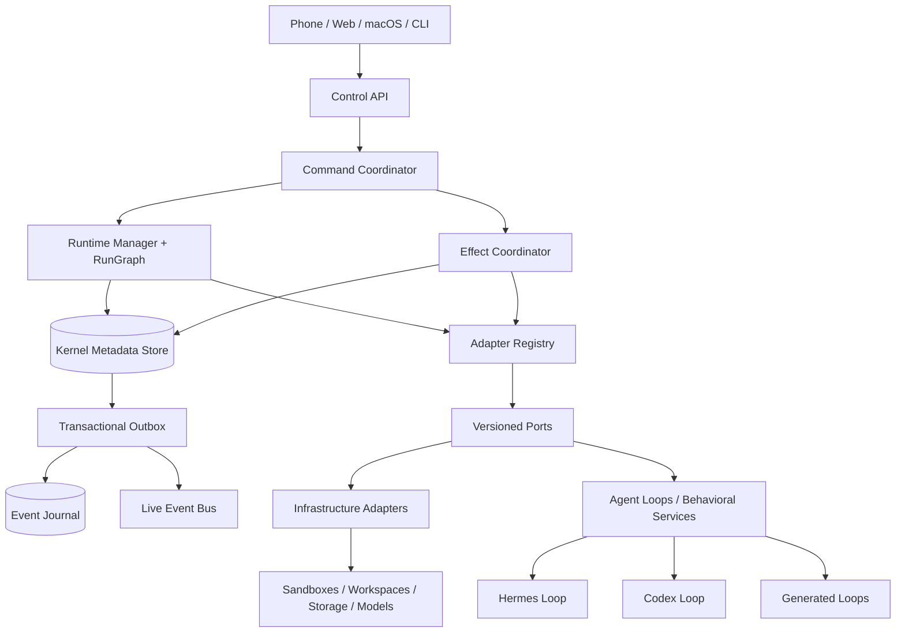

# AI Agent OS Documentation

This is the sole human-authored documentation tree. Normative IDs and schemas live in [`../spec/`](../spec/README.md).

## System at a glance

## Browse

- [Architecture](architecture/README.md)
- [Kernel components](kernel/README.md)
- [Runtime semantics](runtime/README.md)
- [Stable ports](ports/README.md)
- [Adapter system](adapters/README.md)
- [Extension SDK](extensions/README.md)
- [Configuration/profiles](configuration/README.md)
- [Security](security/README.md)
- [Operations/recovery](operations/README.md)
- [Client/control APIs](api/README.md)
- [Developer guides](guides/README.md)
- [Reference](reference/README.md)
- [Implementation plan](../PLAN.md)
